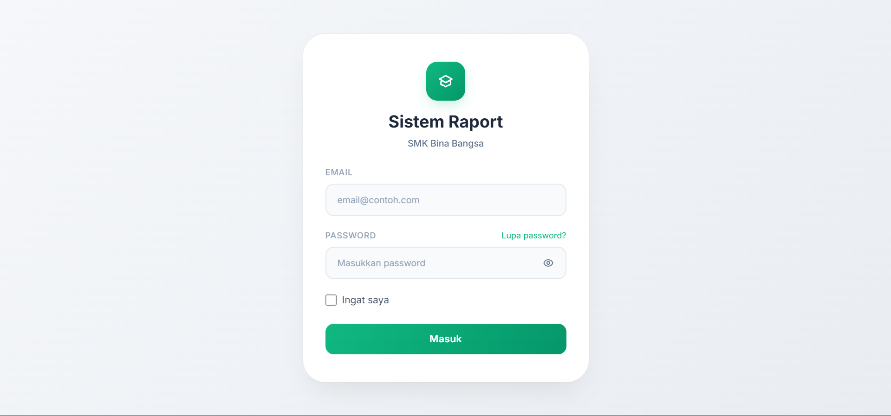
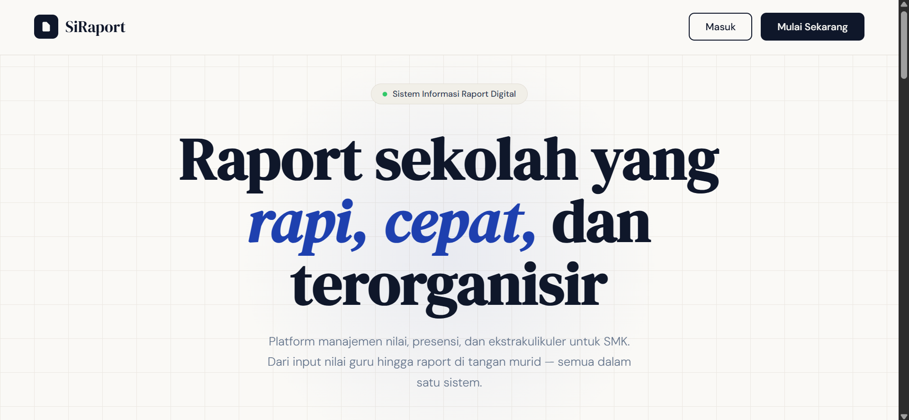
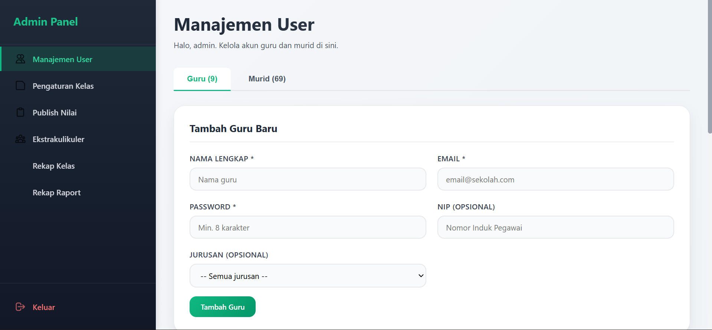
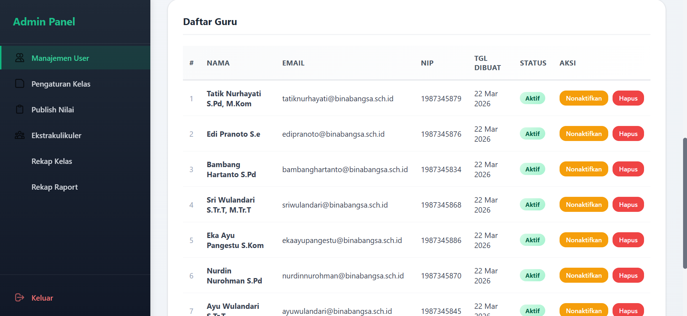
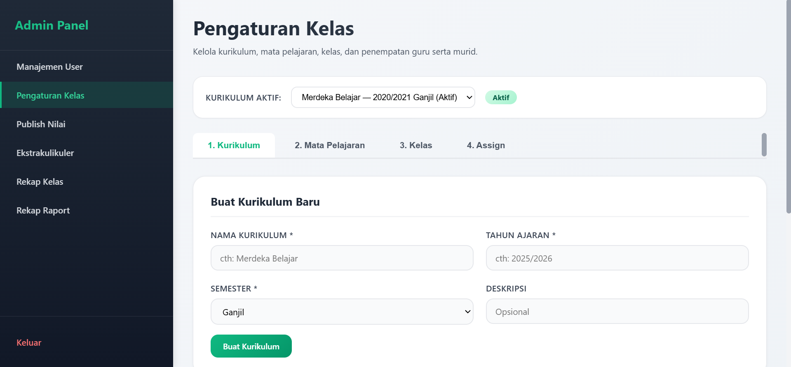
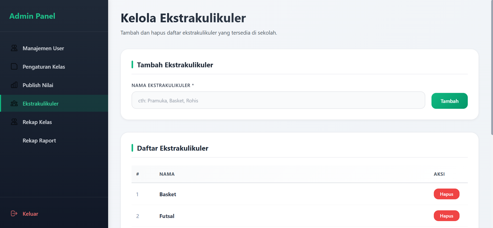
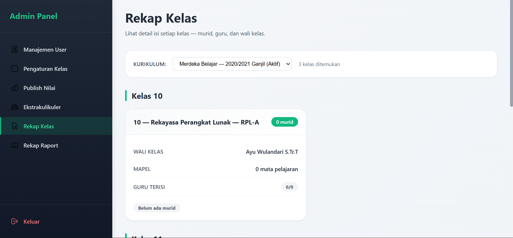
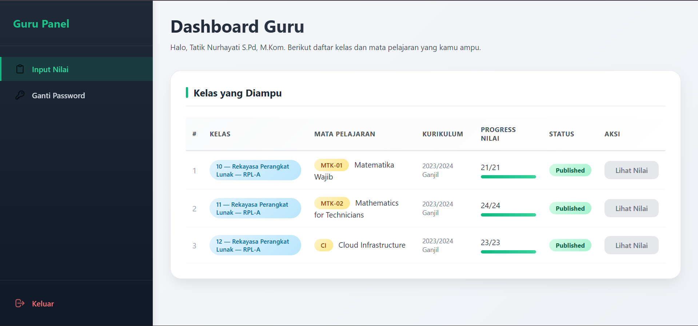
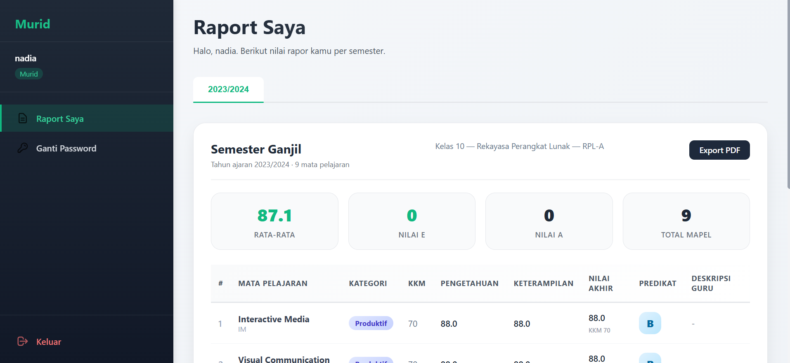
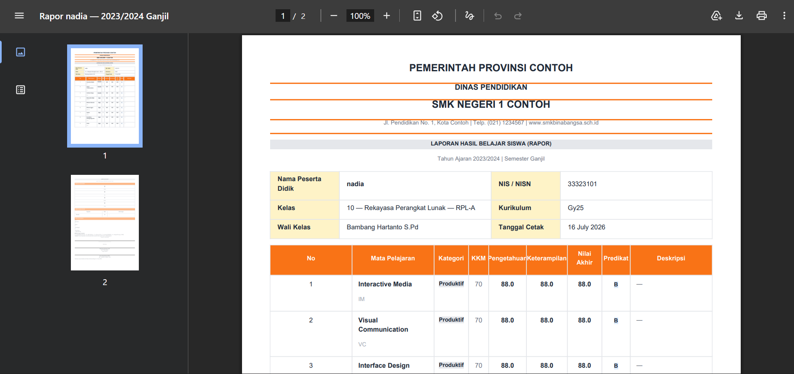

# 📚 Sistem Informasi Manajemen Sekolah


[](https://www.postgresql.org/)
[](https://www.python.org/)
[](https://fastapi.tiangolo.com/)
[](https://argon2.online/)

> Sistem informasi manajemen sekolah berbasis web untuk mengelola data siswa, guru, admin, dan akademik dengan autentikasi aman.

---

## 📋 Daftar Isi
- [Fitur](#-fitur)
- [Teknologi](#-teknologi)
- [Tampilan Aplikasi](#-tampilan-aplikasi)
- [Instalasi](#-instalasi)
- [Default Login](#-default-login)
- [Database Schema](#-database-schema)
- [Lisensi](#-lisensi)

---

## 🚀 Fitur

### 👨‍💼 Admin
- Manajemen User (CRUD admin, guru, murid)
- List & Filter User
- Pengaturan Kelas & Jurusan
- Kelola Ekstrakurikuler
- Rekap Kelas
- Reset Password User

### 👨‍🏫 Guru
- Dashboard khusus guru
- Input & kelola nilai siswa
- Monitoring kelas

### 🧑‍🎓 Murid
- Lihat raport online
- Cetak raport
- Lihat ekstrakurikuler

### 🔐 Keamanan
- Password hashing dengan **Argon2id**
- Role-based access control (Admin, Guru, Murid)

---

## 🛠 Teknologi

| Komponen | Teknologi |
|----------|-----------|
| Backend | FastAPI (Python 3.11) |
| Database | PostgreSQL 16 |
| ORM | SQLAlchemy |
| Autentikasi | Argon2id hashing |
| Frontend | HTML, CSS, JavaScript |
| Server | Uvicorn |

---

## 📸 Tampilan Aplikasi

Berikut adalah tampilan antarmuka aplikasi:

| Fitur | Screenshot |
|-------|------------|
| Halaman Login |  |
| Landing Page |  |
| Admin - Manajemen User |  |
| Admin - List User |  |
| Admin - Pengaturan Kelas |  |
| Admin - Kelola Ekstrakurikuler |  |
| Admin - Rekap Kelas |  |
| Dashboard Guru |  |
| Raport Murid |  |
| Cetak Raport |  |

---

## 💻 Instalasi

### Prasyarat
- Python 3.11+
- PostgreSQL 16+
- pip

### Langkah Instalasi

```bash
# 1. Clone repository
git clone https://github.com/Abong-123/raport.git
cd raport

# 2. Buat virtual environment
python -m venv venv
source venv/bin/activate  # Linux/Mac
# atau
venv\Scripts\activate     # Windows

# 3. Install dependencies
pip install -r requirements.txt
